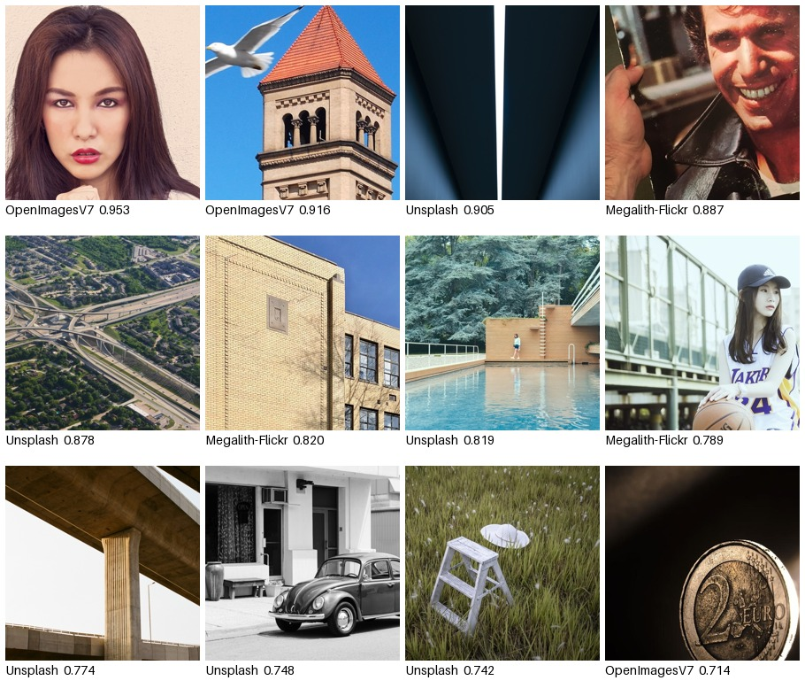

# Error analysis (PLAN.md §11, deliverable #5)

Highest-confidence mistakes on the aug checkpoint's clean-cell test scores
(`results/aug/scores.csv`), pulled and grouped by
`scripts/error_analysis.py`. "Highest-confidence" = furthest past 0.5 on the
wrong side — a real image scored near 1, or an AI image scored near 0 — not
merely misclassified but misclassified with conviction.

Reproduce: `python -m scripts.error_analysis` (needs the real-source and
FLUX.1-dev images locally — see note on data availability at the bottom).

## False positives — real images scored highest

*(source, score. Full ranked list: `false_positives.csv`)*

Top-30 split 12 Unsplash / 10 OpenImagesV7 / 8 Megalith-Flickr — roughly even
across all three real sources, so this isn't one source's artifact.

**The failure mode, named:** every one of these twelve is *professional or
professional-looking photography* — a studio beauty portrait, a
graphic/symmetric architecture shot, an aerial drone shot of a highway
interchange, a magazine-style laughing-man portrait, a macro product shot of
a coin sharp enough to read the mint mark. Sharp focus, deliberate
composition, saturated or high-contrast color, no compression artifacts, no
clutter. In short: the real photos that look the most *deliberate* are the
ones the model is most confident are fake.

This is the exact failure mode the real-source design was supposed to
prevent. `src/data/sources.py`'s docstring explains Unsplash was added
specifically as "the control that stops 'polished' from meaning 'fake'"
after Pexels was dropped for being a source fingerprint — and Unsplash is
still 6 of these 12. The control reduced the problem; it didn't remove it.
The model still reads "well-composed, high-production-value" as partial
evidence of "generated," on top of whatever forensic signal it also uses.

## False negatives by generator

FN rate at threshold 0.5, clean cell, all seven generators (full per-cell,
per-generator numbers with bootstrap CIs: `results/tpr_analysis_aug/report.md`):

| Generator | FN rate |
|---|---:|
| Gemini-nano-banana | 13.9% |
| **FLUX.1-dev** | **12.6%** |
| SDXL | 9.7% |
| RealVisXL-V4.0 | 8.0% |
| Mobius | 3.7% |
| Aura | 2.3% |
| MidJourney | 1.7% |

The two held-out closed-commercial generators are the two highest FN rates —
consistent with `results/baseline/per_generator.md`'s finding that
FLUX.1-dev and Gemini are the hardest generators clean, before and after
augmentation.

### FLUX.1-dev, in depth — the floor generator

*(score only — all from FLUX.1-dev. Full ranked list:
`false_negatives_by_generator.csv`, filter `source == "FLUX.1-dev"`)*

**The failure mode, named:** these are not stylized, dramatic, or
obviously-synthetic-looking images. They are deliberately mundane
photographic subjects, shot in an ordinary snapshot or stock-photography
style: a train photographed head-on, snowboarders mid-action with real-
looking sun flare and powder spray, hikers strung out across a snowy ridge,
a cat looking at a camera indoors, a baseball stadium wide shot, a vintage
propeller plane, an open suitcase, a dog on a leash next to a park bench, a
tiger's face in snow. Natural lighting, candid framing, motion blur where a
real camera would produce it — nothing about the *content* signals
"generated."

This is the opposite failure mode from the false positives above, and the
two read as one story: the model's signal correlates with "does this look
like a deliberate, professional photograph," not with generation artifacts
directly. A professional-looking real photo trips it toward "fake" (false
positive, above); a generator that produces convincing, mundane,
snapshot-style photorealism — which is exactly FLUX.1-dev's and Gemini's
profile, the two most photorealistic generators in the set, both closed-
commercial and both held fully out of training — defeats it in the other
direction (false negative). A frozen semantic backbone (CLIP) is well-suited
to "does this look like a certain kind of photo" and not obviously suited to
"does this contain a specific generator's pixel-level fingerprint," which
is consistent with both halves of the pattern.

## What we'd fix first

**The false negatives, not the false positives.** A missed AI image is the
moderation-relevant failure (content passes as real); a false-positive real
image is a review-queue cost, not a trust failure. Within false negatives,
FLUX.1-dev over Gemini: it's the floor on the primary robustness metric too
(clean TPR@1% = 0.5375, the lowest of all seven — `results/tpr_analysis_aug/
report.md`) and augmentation, tried in Phase 4, provably didn't move it
(paired bootstrap Δ on the per-generator spread = +0.0021, 95% CI
[-0.0508, +0.0429] — see `NOTES.md` §"Phase 4"). Two concrete next steps,
neither tried yet:

1. **Bias the augmentation sampler toward FLUX.1-dev-hard cases specifically**
   rather than degradation families uniformly (`NOTES.md`'s "still open" note)
   — untested, but motivated directly by this montage: if mundane/candid
   *content* is what defeats the model, family-uniform degradation
   augmentation (JPEG/blur/noise/etc.) was never going to touch it, since
   none of those change subject matter or framing.
2. **A texture/artifact-level signal alongside the semantic one** (the
   originally-planned artifact branch, Phase 5, cut for budget) — motivated
   by the same read: if CLIP's signal is largely "does this look like a
   certain kind of photo," a channel that instead looks for generator-
   specific pixel statistics is the more direct fix for exactly this
   failure mode, not a parallel nice-to-have.

## Note on data availability

`data/corpus/` is not checked into this repo (`.gitignore`); the montages
above required re-fetching the specific real-source and FLUX.1-dev images
`results/aug/scores.csv` references, via `scripts/download_data.py`'s
deterministic (seeded, content-hash-addressed) pipeline. All 810 real test
images and 779/800 FLUX.1-dev images were recovered byte-identical to the
original corpus; 21 FLUX.1-dev images (2.6%) landed on different source rows
after one HF parquet row-group timed out mid-fetch and was skipped rather
than retried indefinitely — none of the 30 lowest-scoring FLUX.1-dev images
used above are among them. `false_negatives_by_generator.csv` and
`false_positives.csv` are themselves generated straight from
`results/aug/scores.csv` and are exact regardless.
